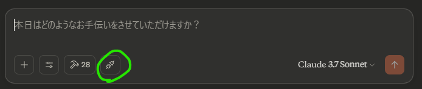
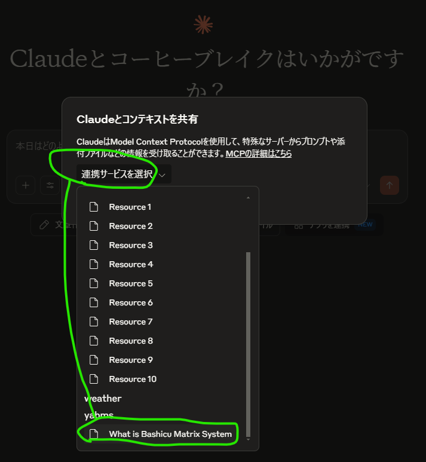

# MCP Server Setup and Usage

This document provides instructions for setting up and using the MCP server in this project.

## Requirements

- MCP Server
  - Node.js
  - npm
  - This project's source code
- MCP Client
  - cline [https://cline.dev/](https://cline.dev/)
  - claude [https://claude.ai/](https://claude.ai/)

## How to prepare the MCP server
### Linux/WSL
- Install Node.js and npm using your package manager.
  ```bash
  sudo apt update
  sudo apt install -y nodejs npm
  ```
- Install the required packages.
  ```bash
  npm install
  ```
### Windows
  - Install Node.js and npm by downloading the installer (.msi) from https://nodejs.org/en/download
- Install the required packages.
  ```cmd
  npm install
  ```
## MCP Clients Settings

Add "yabms" to the "mcpServers" in your configuration file.
- For **claude**, the configuration file is located at:
  `C:\Users\your-user-name\AppData\Roaming\Claude\claude_desktop_config.json`
- For **cline** by WSL, the configuration file is located at:
  `/home/your-user-name/.vscode-server/data/User/globalStorage/saoudrizwan.claude-dev/settings/cline_mcp_settings.json`

### With linux/WSL MCP server
```json
{
  "mcpServers": {
    "yabms": {
      "command": "wsl.exe",
      "args": [
        "bash",
        "-ic",
        "node /your/path/to/yaBMS/mcp/index.js"
      ]
    }
  }
}
```

### With Windows MCP server
```json
{
  "mcpServers": {
    "yabmswin": {
      "command": "node.exe",
      "args": [
        "C:\\path\\to\\yaBMS\\mcp\\index.js"
      ]
    }
  }
}
```

Please adjust the path as necessary for your environment.

## MCP Client usage
Ask your LLM like this:
```
Please expand (0,0,0)(1,1,1)(2,1,0)(1,1,1)[3] by yabms.
```
Then your LLM will anser like this:
```
The expansion of the YABMS expression (0,0,0)(1,1,1)(2,1,0)(1,1,1)[3] is:
(0,0,0)(1,1,1)(2,1,0)(1,1,0)(2,2,1)(3,2,0)(2,2,0)(3,3,1)(4,3,0)(3,3,0)(4,4,1)(5,4,0)[3]
YABMS (Yet Another Binary Multidimensional Sequence) is a notation system used to represent sequences with specific transformation rules.
```

## Resources of yaBMS
For claude, you can give the resource by 'Connect button':



Next, select the resource 'what is Bashicu Matrix System'.



After that, your LLM will get what is BMS.
